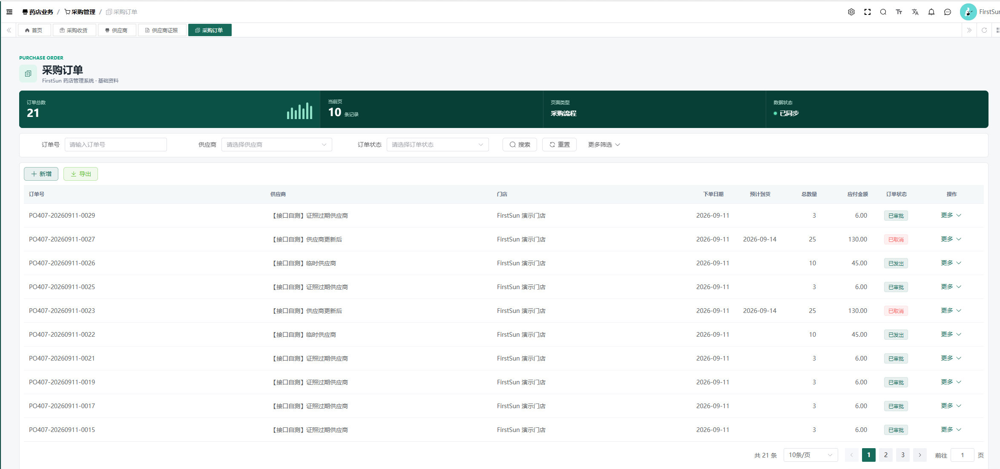
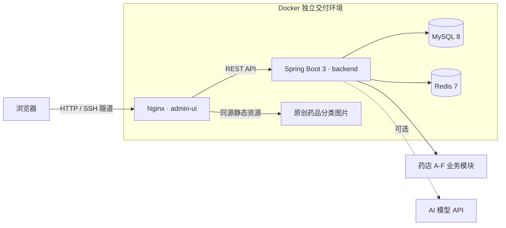

# FirstSun 药店管理系统

面向连锁药店日常经营的课程实践项目，覆盖基础档案、采购、库存、POS、处方与会员等管理场景，并提供可独立复现的 Docker 交付环境。

> 当前 `codex/admin-delivery` 交付范围是 **Web 管理后台**。PR #48 不包含 `mall-uniapp`、微信登录或小程序端功能。

## 项目截图



截图来自仓库内的独立演示环境，展示采购订单、门店、供应商、金额和状态等关联数据。

## 核心能力

| 能力 | 当前交付内容 |
| --- | --- |
| 双入口登录 | 默认进入 FirstSun 药店登录，可切换到芋道平台租户登录 |
| A-F 业务模块 | 基础资料、采购收货、库存库房、POS、处方支付、会员管理 |
| 关联演示数据 | 为 FirstSun 租户（`tenant_id=163`）准备 20 个药品及采购、库存、销售、处方、会员等关联数据 |
| 药品图片 | 使用仓库内原创分类占位图，同源访问，不依赖随机外链或真实包装图 |
| 安全日志 | API 日志对密码、Token、AppSecret、手机号等敏感字段做脱敏处理 |
| 独立部署 | 固定镜像标签、独立 Compose 项目名；支持通过 SSH 隧道访问 |
| 服务隔离 | 交付 Compose 不向宿主机或公网暴露 MySQL、Redis 端口 |

## A-F 模块

| 模块 | 页面与业务范围 | 演示数据覆盖 |
| --- | --- | --- |
| A · 基础资料 | 门店、员工、药品分类、药品档案、药品条码、公共平台能力 | 门店、仓库、库位、员工、20 个药品及条码；药品列表显示本地分类图片 |
| B · 采购收货 | 供应商、证照、采购订单、采购明细、收货入库 | 供应商、不同状态采购单及关联收货记录 |
| C · 库存库房 | 仓库、库位、批次、库存、流水、盘点、调拨、报损与效期预警 | 批次、有效期、门店可售量、库存流水及盘点/调拨记录 |
| D · POS 销售 | 收银、销售单、退货、班次与经营统计 | 会员销售订单、明细、支付状态和班次数据 |
| E · 处方与支付 | 处方登记、明细、药师审核、支付与退款记录查询 | 处方及审核状态、支付应用和关联记录；不接真实支付渠道 |
| F · 会员管理 | 会员档案、等级、积分、地址和订单数据 | 合成会员、等级、积分流水、地址及订单关联数据 |

模块以真实菜单、表结构和已验证页面为准。旧验收报告中记录的未闭环项不因演示数据补齐而自动视为已完成。

## 技术架构



| 层级 | 主要技术 |
| --- | --- |
| 管理后台 | Vue 3、TypeScript、Vite、Element Plus、pnpm |
| 后端 | Java 17、Spring Boot 3、MyBatis Plus、Maven |
| 数据与缓存 | MySQL 8、Redis 7 |
| 交付 | Docker、Docker Compose、Nginx、SSH 隧道 |

## 目录结构

```text
FirstSun-Pharmacy-Management-System/
├─ admin-ui/                       # Web 管理后台
│  └─ public/pharmacy-demo/        # 原创药品分类占位图与许可说明
├─ backend/                        # Spring Boot 后端
├─ deploy/                         # 独立交付 Compose 与部署说明
├─ docs/                           # 协作规范、验收报告与截图
├─ sql/                            # 基础 SQL 与幂等迁移
│  └─ migrations/                  # 含第 38 份交付演示数据迁移
├─ mall-uniapp/                    # 仓库既有目录，不属于当前 PR 交付范围
├─ docker-compose.yml              # 团队本地开发环境
└─ README.md
```

## 快速启动

交付环境需要 Docker、Docker Compose 和约 2 GiB 可用内存。先从样例创建本地配置，并按部署指南构建两个固定标签镜像：

```bash
cp deploy/.env.prod.example deploy/.env.prod
# 按本机环境填写 deploy/.env.prod；该文件已被 Git 忽略

docker buildx build --platform linux/amd64 -t firstsun-admin-delivery-backend:codex-20260922 -f backend/Dockerfile --load backend/
docker buildx build --platform linux/amd64 -t firstsun-admin-delivery-admin-ui:codex-20260923-demo-data -f admin-ui/Dockerfile --build-arg VITE_BASE_URL=http://localhost:48080 --load admin-ui/
docker compose -p firstsun-admin-delivery -f deploy/docker-compose.prod.yml --env-file deploy/.env.prod up -d
```

首次创建数据卷时，MySQL 按 `01` 至 `38` 的顺序初始化。端口、健康检查、SSH 隧道、升级和回滚步骤见 [交付部署指南](deploy/README-deploy.md)。

## 演示账号

| 项目 | 内容 |
| --- | --- |
| 租户 | `FirstSun` |
| 用户名 | `0407` |
| 密码 | `123456` |

该账号仅用于本地演示和团队联调。首次用于受控部署后应立即改密；仓库不提供生产凭据，也不展示 `deploy/.env.prod` 的内容。

## Docker 部署入口

[deploy/README-deploy.md](deploy/README-deploy.md) 是交付部署的唯一完整指南，包含：

- 固定镜像标签与构建命令；
- 独立 Compose 项目、数据卷和初始化顺序；
- SSH 隧道访问方式；
- 健康检查、日志、升级、回滚和精确清理命令；
- 2 GiB 主机的内存预算与风险说明。

生产式演示环境只将管理后台和后端绑定到回环地址；MySQL、Redis 只在 Compose 网络内通信，不映射公网端口。

## 测试与验证

<details>
<summary>本交付分支已留存的验证结果</summary>

| 检查项 | 结果 |
| --- | --- |
| 第 38 份 SQL 在保留数据卷执行 | 通过 |
| 同一 SQL 再次执行的幂等性 | 通过，未产生重复业务行 |
| 全新数据卷按 01-38 初始化 | 通过 |
| FirstSun 登录与管理后台健康检查 | 通过 |
| 药品档案图片、采购订单等页面检查 | 通过 |
| 前端生产构建 | 通过，包含药品图片列表功能与 5 张原创 SVG |
| API 日志脱敏定向测试 | 通过（9/9）；改密请求 oldPassword/newPassword 明文不落控制台与访问日志，AI token 数量字段不被误伤；独立容器真实 HTTP 登录、异常响应与 Docker 日志复验通过 |
| 第 38 份 SQL 前置缺失/冲突测试 | 通过；一次性 MySQL 实测前置记录缺失、跨租户主键及业务唯一键冲突均安全失败回滚，无孤儿数据 |
| `docker compose config` 与 `git diff --check` | 通过 |

验证结果针对当前交付范围，不等同于真实支付、外部 AI 服务或全部历史业务缺陷均已完成验收。

</details>

详细历史证据位于 [验收报告目录](docs/acceptance/reports/)。报告反映其生成时的代码状态，阅读时请结合当前分支和“已知限制”。

## 安全设计

- `local` profile 下的认证请求参数整体遮盖，其他 API 请求移除常见敏感字段；异常消息和响应体不写入访问日志，MyBatis Mapper 不输出参数级 DEBUG 日志。此策略针对应用自身的 API 日志，不能替代网关及其他第三方日志的独立检查。
- 租户数据按 `tenant_id` 隔离；交付演示业务数据统一属于 FirstSun 租户 `163`。
- `deploy/.env.prod` 被 Git 忽略，仓库只提供不含真实密钥的配置样例。
- 药品图片随仓库交付，由 Nginx 同源提供，避免外链可用性和授权风险。
- MySQL、Redis 不暴露宿主机端口；远程访问管理后台使用 SSH 隧道。
- 真实支付默认关闭，演示环境不得配置真实支付密钥。

## 已知限制

- 当前 PR 不包含 `mall-uniapp`、微信登录或小程序功能。
- 真实支付默认关闭；演示数据中的支付状态不代表真实支付渠道已接通。
- AI 助手需要使用者自行配置 `PHARMACY_AI_API_KEY`；未配置时只有 AI 能力不可用，不应伪造成功结果。
- 云服务器 2 GiB 内存余量偏紧，建议配置 Swap 或提高内存，并监控 MySQL 与 JVM 占用。
- 阴凉库近效期弹窗仍有已知显示问题；相关列表数据可展示，但该弹窗不应作为完整验收通过项。
- 芋道平台入口、外部 AI 模型真实调用和长期稳定性仍需按目标环境单独验证。

## 团队协作与贡献

开始开发前请先阅读：

- [团队开发须知](docs/团队开发须知.md)
- [六人全栈开发方案](docs/六人全栈开发方案.md)
- [开发规范与 AI 协作规则](docs/开发规范与AI协作规则.md)
- [前端界面统一规范](docs/前端界面统一规范.md)

建议按“独立分支 → 定向测试 → Pull Request → 人工审查”的流程协作。提交不得包含真实凭据、运行日志、构建产物、数据库数据卷或个人环境文件。

## License 与用途

本项目基于 Yudao / RuoYi-Vue-Pro 进行课程实践和二次开发；后端与管理后台的授权分别见 [backend/LICENSE](backend/LICENSE) 和 [admin-ui/LICENSE](admin-ui/LICENSE)，并请同时遵守对应上游项目许可。

本仓库用于教学、课程答辩、团队协作和功能演示，不构成医疗建议，也不应未经安全、合规和真实业务验收直接用于生产药店系统。
