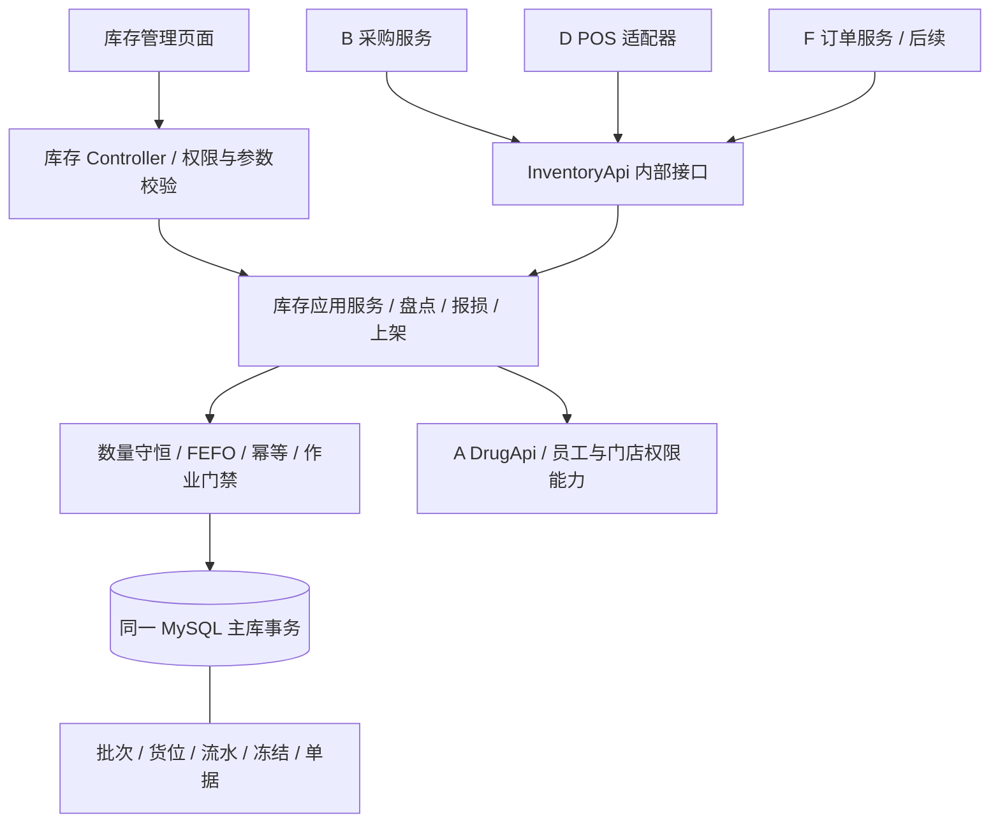

# C 技术架构与接口契约草案

状态：供开发与团队评审使用，尚未实现。接口命名、错误码、字典编号与迁移均不得视为已冻结的团队契约。

## 1. 采用现有单体架构

后端继续使用同一个 `backend/yudao-server`，库存是 `yudao-module-pharmacy` 内的业务域。跨业务域调用 Java 接口，不拆微服务，不为同库事务引入 HTTP、消息队列或分布式事务。

基线 POM 声明 Java 8 编译目标、Spring Boot 2.7.18、MyBatis-Plus 3.5.17；前端 package.json 声明 Vue 3.5.34、Element Plus 2.13.7、TypeScript 6.0.3、Vite 8.1.4，使用 pnpm 与已有锁文件。这里只记录仓库声明，不代表依赖已在本机安装或运行验证。MySQL 脚本要求 8.0.28 以上。A 分支容器 Java 17 与编译目标的差异由集成负责人统一处理，C 不自行升级依赖。



Redis 复用框架能力，不作为库存真值或幂等最终依据。读库存余额和重放结果应走主库；不能因读写分离延迟重复执行。

## 2. 目录与职责

以下是拟建目录。`main` 尚无 pharmacy 模块，应先集成 A 的公共骨架；A 参考分支已有同名模块，禁止重复建第二个。

```text
backend/yudao-module-pharmacy/
  src/main/java/cn/iocoder/yudao/module/pharmacy/
    api/inventory/InventoryApi.java
    api/inventory/dto/                  # C 契约，不复用 Web VO
    controller/admin/inventory/
    controller/admin/inventory/vo/
    service/inventory/                 # 查询、写入、盘点、报损、移位、预警
    dal/dataobject/inventory/
    dal/mysql/inventory/
    enums/inventory/                   # C 错误标识与枚举，避免覆盖 A 常量
  src/main/resources/mapper/inventory/
  src/test/java/cn/iocoder/yudao/module/pharmacy/inventory/
  src/test/resources/inventory/
admin-ui/src/views/pharmacy/inventory/
admin-ui/src/api/pharmacy/inventory/
sql/migrations/<日期>_c_inventory_<用途>.sql
docs/C-inventory/
```

- Controller：请求验证、登录权限与数据范围、调用服务、返回 `CommonResult` / `PageResult`；不写库存 SQL。
- 查询服务：分页/详情、FEFO 预览、可售量、对账；不同角色返回不同字段，成本对 F 隐藏。
- 写入服务：唯一库存写入口，处理来源校验、作业门禁、事务、幂等、数量变更与流水。
- 盘点/报损/移位服务：状态机编排；实际数量变更委托库存核心服务。
- 盘点调整先锁定范围并验证整单快照，再计算和执行全部差异；不能每更新一行后拿已变化的批次 version 去比较同一批次其他行的旧快照。
- Mapper：只用于所属表；定制 SQL 必须有租户、归属与逻辑删除条件，使用参数绑定。
- DO：优先复用现有 `TenantBaseDO` 及审计能力，结合集成后的 A 模式确定；不可因 A 某 DO 只继承 BaseDO 就忽略租户验证。

## 3. 当前表结构和设计缺口

| 表 | 关键事实 | C 使用方式/缺口 |
| --- | --- | --- |
| `ph_warehouse` | 门店、温区、默认仓、1启用/0停用；租户+门店+编码唯一 | 不套用框架可能不同的启停枚举；默认仓并发唯一尚无约束 |
| `ph_location` | 仓库、货位码、容量、类型、状态 | 仓库决定门店；不能接收互相矛盾的归属 |
| `ph_inv_batch` | 批次唯一键；total/avail/frozen/sold；4位成本；version | 每次数量变化递增 version；同批次元数据不能随意覆盖 |
| `ph_inv_location_stock` | batch+location 唯一；qty、qty_frozen | 所属仓库、药品须与批次一致 |
| `ph_inv_flow` | 按批次货位记录；来源单号/行；冻结变化；成本；事件唯一键 | 缺操作级请求摘要、完整结果与原出库引用；单靠唯一键不足以保证重新选批幂等 |
| `ph_inv_stocktake` / `_line` | 0草稿/1进行中/2完成/3调整；审核时间；location；实盘允许 NULL | 缺取消状态、驳回意见、版本快照；“冻结策略”需明确语义 |
| `ph_inv_damage` / `_line` | 审批、执行、复核人；一次销毁信息；成本两位 | 复核时间/意见等不足；4位批次成本与2位单据成本需处理 |
| `ph_inv_expiry_alert` | tenant+batch+date 唯一；1/2/3 级别 | 是每日提醒，不是放行库存的依据 |
| `ph_inv_lock` | 订单/盘点/质量锁；货位、来源行、过期时间、0/1/2 状态 | 表已存在，分工归属未补；P2 基于它，不重复建冻结表 |

当前已有 11 张库存相关表（分工 10 表 + 冻结表）。如果批准下述操作表，C 涉及 12 表、业务初始化基线总数将从 46 增至 47；框架表另计。这是提案，未执行。

### 建议增量迁移

| 优先级 | 草案 | 理由及影响 |
| --- | --- | --- |
| P0 | 新建 `ph_inv_operation` | 操作级幂等先于选批、结果重放、请求冲突判断；由 A/B 确认表数和迁移 |
| P0 | flow 增加 `operation_id`、`original_flow_id` 及查询索引 | 关联请求及原出库分配，支持退货累计控制；历史数据允许为空并明确切换边界 |
| P0 | 默认仓唯一约束/串行控制 | 建议 MySQL 生成列对“启用且默认且未删除”返回 store_id，其余 NULL，按 tenant_id+该列唯一；先清点重复数据，不能自动删数据 |
| P1 | stocktake 增加取消状态定义、审批/驳回/取消意见与人员时间；line 增加批次版本快照 | 状态可追溯并验证账面快照；不覆写既有状态数字 |
| P1 | damage 增加复核时间/意见、驳回原因；行成本精度调整为四位或新增精确快照 | 不由执行人冒充复核；明确金额四舍五入来源 |
| P1 | flow/biz 字典增加同仓移位类型 | 建议 flow_type=60、biz_type=8，须检查全仓库枚举冲突后确定 |

`ph_inv_operation` 拟定字段：id、tenant_id、store_id、operation_type、biz_type、biz_no、request_hash（64位十六进制 SHA-256）、result_json、operator、create_time/update_time 等审计字段；唯一键 `(tenant_id, store_id, operation_type, biz_type, biz_no)`。它是成功业务事件的不可变凭据，不提供编辑或软删除后重做接口。

状态变更除保存当前审核/执行字段外，还应记录每次驳回、取消等动作的追加审计事件。优先复用已接入的框架操作日志；若要写公共 `ph_audit_log`，先由 A 确认接口与归属，不能仅覆盖最新意见后声称保留了完整历史。

一个来源业务事件一份不可变请求，例如每张收货单入账、每张销售单扣库、每张退货单回补。分批收货用不同收货单，不能复用采购单号；部分退货用不同退货单号。请求含全部明细，规范化后计算摘要；同一明细多个相同批次货位项先聚合，避免流水唯一键冲突。

规范化包括 operationType、storeId、来源、固定排序的明细及显式分配、数量、日期、成本等影响结果的字段；排除重试时间等非业务字段。相同键同摘要返回原结果，换参数返回冲突。事务失败整体回滚操作记录，允许同事件重试；成功提交但响应丢失时可读回结果。

开发阶段再编写可执行 SQL。新增唯一约束前先给出重复数据报告；测试在独立空库及升级副本上分别验证。不能以修改已执行初始化脚本代替迁移；不自动重建用户现有数据库。

## 4. 数量变化与成本

下表 q>0，均同步更新批次和对应货位；“可用”是账面可用，销售另做有效性过滤。

| 操作 | total | avail | frozen | sold | flow |
| --- | --- | --- | --- | --- | --- |
| 收货 | +q | +q | 0 | 0 | 10，in=q |
| 普通销售 | -q | -q | 0 | +q | 20，out=q |
| 原销售退货 | +q | +q | 0 | -q | 21，in=q，关联 original_flow_id |
| 盘盈/盘亏 | ±q | ±q | 0 | 0 | 40，in 或 out |
| 报损 | -q | -q | 0 | 0 | 50，out=q |
| 订单冻结 | 0 | -q | +q | 0 | 80，frozen_delta=+q |
| 订单释放 | 0 | +q | -q | 0 | 81，frozen_delta=-q |
| 冻结转销售 | -q | 0 | -q | +q | 82，out=q，frozen_delta=-q |
| 同仓移位 | 合计0 | 合计0 | 0 | 0 | 拟60，源出q、目标入q |

每笔流水 `balance_qty` 定义为该条变动后的批次在库总量，不是货位余额。移位用同一事务内源出/目标入顺序记账，内部计算连续余额，最终批次总量不变。冻结/释放只改变冻结账，in/out 均为 0。流水不可更新/删除，冲销用新的关联业务事件。

成本采用 `BigDecimal`。同批次再次收货拟按在库数量加权：`(旧qty_total×旧cost + 入库qty×入库cost) / 新qty_total`，保留4位；入库数量为0或负数直接拒绝。销售出库写4位成本快照，P0 退货按原出库成本回补并重新计算在库加权成本，不能取当日药品参考成本。

金额展示/单据汇总保留2位，拟按行金额 `qty×精确成本` 四舍五入后累加。盘点盘盈采用当前批次成本；盘亏/报损使用当前成本快照，零库存新批次盘盈暂不开放。D 销售明细成本当前为2位，需要约定库存4位结果如何存储/舍入；不能静默截断后声称财务价值完全一致。成本规则须 B/D 确认。

## 5. 事务、并发与幂等

### 写入流程

1. 入口校验身份、租户/门店范围、来源单据状态及请求参数。B/D 的外层业务服务须开启同一个主库本地事务。
2. C 写入服务使用 Spring 事务代理及 `@Transactional(rollbackFor = Exception.class)`，默认 REQUIRED 加入外层事务；禁止异步、REQUIRES_NEW 和切换数据源破坏原子性。
3. 在选批前建立/读取操作幂等记录。唯一键冲突由事务边界正确处理，必要时回滚后在新事务读已提交结果；不能捕获异常后在已标记回滚的事务里继续写。
4. P0/P1 为可审查的正确性，采用仓库粒度串行写：确定涉及仓库集合，按仓库 ID 升序加行锁，再按批次 ID、货位 ID 升序加锁。自动选批应先锁定门店内允许参与的仓库集合，再重新查询候选批次。FEFO 的分配顺序与加锁顺序分开。
5. 所有入库、销售、退货、盘点、报损、移位和冻结路径均遵守同一锁顺序及仓库作业门禁。新批次/新货位库存的创建也必须持有所属仓库锁，避免“首笔不存在行”绕过行锁。
6. 重新验证批次质量、实时效期、库存、仓库/货位启用、药品合法性与容量；读取现值计算受约束更新，影响行数必须符合预期。
7. 更新批次、货位、锁记录、version，写全部流水并保存返回分配结果；B/D 在同事务内更新自己的单据。任意失败抛业务异常，全部回滚。
8. 事务提交后才向请求方返回成功；重复事件从主库重放已保存结果，不能重新 FEFO 选批。

同仓串行方案优先保证课程范围内正确性，性能未测试，不承诺并发指标；确认瓶颈后才细化为药品/批次锁。事务中不能等待用户、调用第三方支付或长时间网络请求。死锁/锁超时向上返回可重试错误；如自动重试，限定次数并重跑整个业务事务，不能只重跑最后一条 SQL。

操作幂等记录、业务单头及仓库锁的外层获取顺序要和 B/D 一起固定，禁止 C 反向调用 B/D 服务而形成循环锁。每个外层业务事件只调用一次库存批量写操作；多行全部放进同一请求。

### 退货追溯

`original_flow_id` 指向原销售出库流（20或82）。锁定原分配，累计该分配已成功回补数量，校验本次不超未退量；原归属、药品、批次、货位不可由客户端覆盖。D 同时负责销售单/退货单数量与金额校验，C 防止同原出库量被不同退货单重复回补。

### 冻结扩展

P2 使用已有 `ph_inv_lock`。一期冻结只支持每个分配整体释放或整体转出库，部分消费需另增已消费/已释放数量模型后再开放。并发支付/取消必须锁同一订单库存状态，CAS `0→1` 或 `0→2` 只能一个成功；已释放库存不能再转换出库。

到期任务用限定租户上下文、幂等业务键、主库事务重新检查订单/锁状态。F/D/E 确认“支付”或“核销”哪个时点扣库，不能两次扣库。锁定后药品过期/停售时禁止转销售，并进入订单取消/人工处理；释放仍可执行。

## 6. Java 内部契约草案

建议对外接口名 `InventoryApi`。以下签名与 DTO 是待落地设计；目前 `main` 中不存在。

```java
InventoryAvailabilityRespDTO queryAvailability(InventoryQueryReqDTO request);
InventoryAllocationRespDTO previewAllocation(InventoryAllocateReqDTO request);
InventoryOperationRespDTO receive(InventoryReceiveReqDTO request);
InventoryOperationRespDTO deduct(InventoryDeductReqDTO request);
InventoryOperationRespDTO returnBack(InventoryReturnReqDTO request);
// P2，与 F 明确生命周期后增加：reserve / release / consumeReservation
```

### 请求字段

| 对象 | 必要字段与含义 |
| --- | --- |
| 查询 | storeId、drugIds；可选 warehouseId、batchId、locationId。上下文提供 tenantId 和数据范围 |
| 选批预览 | storeId、drugId、qty、允许仓库范围；返回候选分配但不占用库存，提交时重新校验 |
| 写入公共头 | storeId、bizType、bizNo、lines；operationType 由调用方法决定，操作者由可信上下文提供 |
| 收货行 | bizLineId=收货明细ID、drugId、warehouseId、locationId、batchNo、manufactureDate、expiryDate、supplierId、qty、unitCost |
| 扣库行 | bizLineId、drugId、qty；模式为 AUTO_FEFO 或显式 allocations；显式分配含 batchId/locationId/qty，汇总必须等于行数量 |
| 回补行 | bizLineId=退货明细ID、originalFlowId、qty；原批次/货位/成本从历史记录取得 |
| 写入结果 | operationId、replayed、allocations[]：bizLineId、flowId、batchId、batchNo、expiryDate、locationId、qty、unitCost、balanceQty |

金额在库存内部按元，成本4位；日期 `yyyy-MM-dd`，时间含明确业务时区。Web 金额若采用字符串需在 TS 类型和序列化中一致，不先写出与现有项目不兼容的 DTO。数量返回整数；Long ID 前后端表示需沿用集成基线，若数值会超过 JS 安全整数范围，应由 A 统一约定字符串 ID。

租户与操作人不来自不受信任的前端字段。后台任务必须显式建立限定租户上下文并使用可信服务身份。拒绝任意客户端伪造 bizType、来源事件或批次成本。

### 与 D 现有接口的差距

在 D 快照中已存在：

```java
DeductResult deduct(Long storeId, List<DeductItem> items);
void returnBack(Long storeId, List<ReturnBackItem> items);
```

`DeductItem` / `ReturnBackItem` 只有 `drugId/batchId/qty/locationId`；`DeductResult` 只有 success/errorMsg。缺业务单号、业务明细ID、请求幂等头、原出库引用与实际分配结果。不得根据线程局部变量、当前时间或药品组合猜造业务单号来兼容。

建议与 D 商定带来源头的新版方法/DTO，让 POS 适配器调用 C 的 `InventoryApi`；旧方法在缺少必要信息时保持明确失败，迁移 D 调用点后再删除。D 的销售行目前要求 batchId/locationId 非空：若希望 C 自动 FEFO，必须一起约定实际分配拆行和来源行 ID 的生成时序。最小接入可先用预览得到明确分配，由 D 建立稳定行 ID，C 在正式扣库时严格校验原分配，失败让 POS 刷新重试。

D 当前 `FacadeFallbackConfiguration` 使用 `@ConditionalOnMissingBean` 注册失败占位。集成时验证只存在一个有效 Bean；不能只因注解存在就假设注册顺序一定正确，不用全局允许 Bean 覆盖或 `@Primary` 掩盖重复配置。

### 与 A/B/F 的接入

- A 已有 `DrugApi.getDrug/getDrugList/validateDrugList/getDrugByCode`；其中 validate 要求启用且审核通过，适合销售/正常收货校验，不能用来阻断过期或停售库存的报损和历史查询。
- A `DrugRespDTO` 提供 storageCond、status、approveStatus 等字段；员工服务有 `getEmployeeByUserId`。门店权限与允许仓库范围的共用契约尚待确认，不虚构已有 StoreScopeApi。
- B 负责验证收货单状态与质检、将 receipt line 的 ID 传入并回填 `create_batch_id`；C 接收 unitCost 并返回实际批次。质检失败不可调用成功入账分支。
- F 首先使用只读可售量。冻结写操作在业务单号与状态机确认前不开放；小程序不能直接调用管理端库存写接口。

## 7. 管理端 HTTP 与权限草案

Controller 路径前缀拟为 `/pharmacy/inventory`，框架对管理端通常添加 `/admin-api`；开发时检查现有配置，避免前端 request 基础路径再重复拼接。

| 资源 | 方法/后缀草案 | 权限后缀 |
| --- | --- | --- |
| warehouse / location | GET page/get，POST create，PUT update/update-status，DELETE delete（仅未使用） | query/create/update/delete |
| batch | GET page/get/location-stock/availability | query |
| flow | GET page/get | query |
| putaway | POST execute | execute |
| stocktake | GET page/get；POST create/start/record/complete/approve/reject/cancel | query/create/update/approve/cancel |
| damage | GET page/get；POST create/submit/approve/reject/review/execute/cancel | query/create/update/approve/review/execute/cancel |
| expiry | GET page；POST refresh/handle | query/refresh/handle |
| reconciliation | GET page | query |

完整权限建议为 `pharmacy:inventory-<resource>:<action>`。上述 putaway 等写操作需要稳定业务键和必要版本校验。菜单、字典和权限编号由 A 集成；本轮未创建路由或菜单。不能开放任意 `adjustQty`、任意收货入账或销售扣库 HTTP 接口给管理端绕过业务单据。

业务错误符号草案：`INVENTORY_NOT_ENOUGH`、`BATCH_EXPIRED`、`BATCH_NOT_SALEABLE`、`INVENTORY_SCOPE_DENIED`、`INVENTORY_REQUEST_CONFLICT`、`INVENTORY_STATE_CONFLICT`、`STOCKTAKE_ACTIVE`、`RETURN_EXCEEDS_ISSUED`、`LOCATION_CAPACITY_EXCEEDED`。数值码由 A 分配，沿用全局异常处理，不以 HTTP 200 + success=true 伪装失败。

## 8. 对账与可观测性

按 tenant/store/batch 核对批次总量与货位汇总、冻结量与有效锁汇总、期初加累计 in-out 与批次量、净销售与销售出/退流水。冻结流水单独累计 frozen_delta，不混进物理入出。

流水起点必须覆盖期初库存（flow_type=70）；历史直接导入余额而无期初流时应报“对账基线缺失”，不能推断库存正确。对账报告记录检测时间和最大流水 ID，长查询需一致快照或短事务，避免将读取时点不同当作真实差异。

日志记录 operationId、bizNo、错误标识和耗时，不记录登录凭据、完整个人资料或用户密码。接口文档及演示只展示已实现和已验证的能力。
